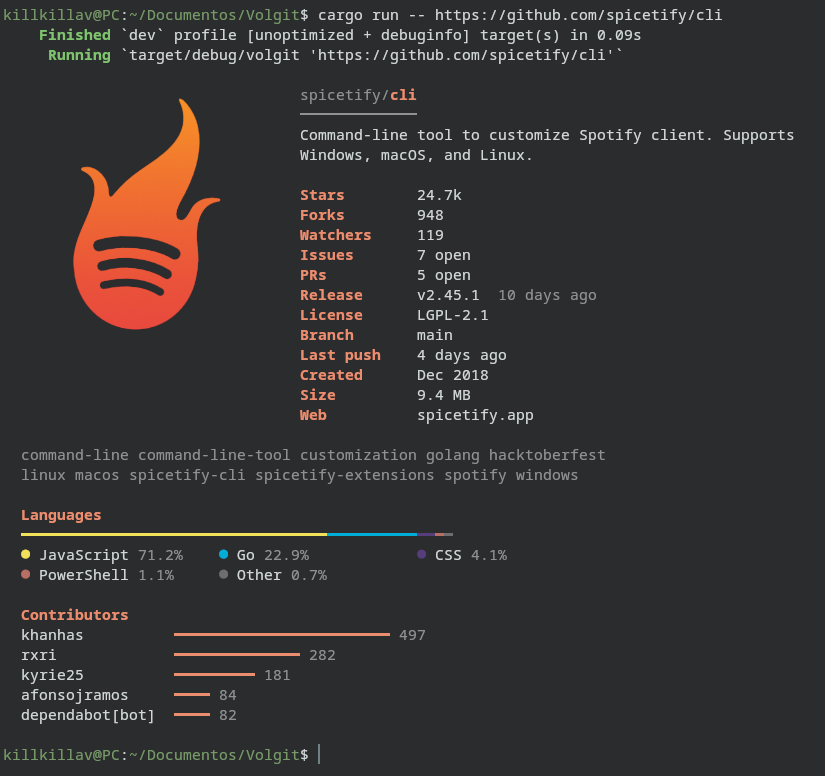
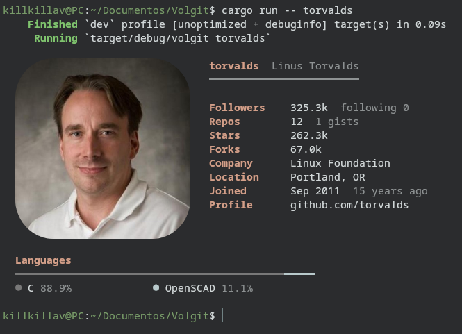

<div align="center">

<!-- TODO: logo / sticker. Example:  -->

# volgit

**GitHub repositories, users and organizations, right in your terminal.**

[](LICENSE)
[](https://github.com/KillKillaV/volgit/releases)
[](https://github.com/KillKillaV/volgit)
<!-- Once published on crates.io:
[](https://crates.io/crates/volgit)
-->

<h3>
<a href="#features">Features</a> •
<a href="#installation">Installation</a> •
<a href="#usage">Usage</a> •
<a href="#configuration">Configuration</a> •
<a href="#faq">FAQ</a>
</h3>

</div>

---

**volgit** is a command-line tool that shows a card for any GitHub repository, user or organization: stars, releases, languages, contributors, recent activity, the contribution graph and the avatar, drawn right in the terminal (as a real image in kitty, Ghostty and WezTerm).

It is inspired by [onefetch](https://github.com/o2sh/onefetch), but where onefetch reads a Git repository on your disk, volgit talks to the GitHub API. You can look up **any** public repo or profile without cloning anything, and **compare** several of them side by side.

|                                                      |                                                 |
| ---------------------------------------------------- | ----------------------------------------------- |
|  |  |

## Features

### Repository card

Stars, forks, watchers, open issues and pull requests (counted separately, which GitHub doesn't do), latest release, license, last push, size, topics, a language bar and the top contributors.

```sh
volgit sharkdp/bat
```

### User and organization profiles

Followers, total stars across their repos, company, location, main languages… Add their top repositories with `--repos` and what they have been up to lately with `--activity`.

```sh
volgit @BurntSushi --repos --activity
```

### Real avatars in kitty, Ghostty and WezTerm

In terminals that support the [kitty graphics protocol](https://sw.kovidgoyal.net/kitty/graphics-protocol/), the avatar is shown as a real high-resolution image with rounded corners. Everywhere else it is drawn with colored half blocks (`▀`). It is detected automatically; use `--image kitty` or `--image blocks` to force a mode.

The accent color of the card (labels and titles) is taken from the avatar, so every profile gets its own.

<!-- TODO: screenshot, kitty vs blocks side by side -->

### Contribution graph

The green squares from the GitHub profile page, with month labels and a breakdown by type (commits, pull requests, reviews, issues). It adapts to the terminal width.

```sh
volgit @BurntSushi --panel
```

> [!NOTE]
> The contribution graph is only available through GitHub's GraphQL API, which requires a [token](#github-token).

<!-- TODO: screenshot -->

### Compare side by side

Pass several repositories (or several users) and volgit prints them as columns, with the best value of each row highlighted. Useful when choosing between libraries: you can tell at a glance which one is alive and which one hasn't had a release in two years. They are fetched in parallel, so comparing three takes about as long as looking up one.

```sh
volgit tokio-rs/tokio async-rs/async-std smol-rs/smol
volgit @BurntSushi @sharkdp @dtolnay
```

<!-- TODO: screenshot -->

### And also

- **Config file** for your favorite defaults.
- **Cache**: repeating a lookup is instant and doesn't spend API requests.
- **Shell completions** for bash, zsh and fish.
- **JSON output** with `--json`, for scripts and `jq`.
- Works from inside a local repo: plain `volgit` uses its `origin` remote.

## Installation

volgit runs on **Linux**. macOS should work but hasn't been tested yet. Windows is not supported for now.

### With Cargo

If you have a [Rust toolchain](https://rustup.rs):

```sh
cargo install --git https://github.com/KillKillaV/volgit
```

<!-- Once published on crates.io:
```sh
cargo install volgit
```
-->

### Prebuilt binaries

<!-- TODO: once there are releases with binaries -->
Download the binary for your platform from the [releases page](https://github.com/KillKillaV/volgit/releases), make it executable and put it somewhere in your `PATH`:

```sh
chmod +x volgit
mv volgit ~/.local/bin/
```

### From source

```sh
git clone https://github.com/KillKillaV/volgit
cd volgit
cargo install --path .
```

### GitHub token

volgit works without a token, but GitHub then only allows **60 requests per hour**, and a profile takes up to 7. With a token the limit goes up to **5,000**, and the contribution graph becomes available.

1. Create a *fine-grained* token at <https://github.com/settings/personal-access-tokens>. It doesn't need **any** permission: public data can be read without them.
2. Export it in your shell config (`~/.bashrc`, `~/.zshrc`…):

   ```sh
   export GITHUB_TOKEN=github_pat_...
   ```

## Usage

```sh
volgit sharkdp/bat                    # repository card
volgit https://github.com/o/r.git     # URLs work too (https or ssh)
volgit                                # the repo in the current directory
volgit @BurntSushi                    # user profile
volgit rust-lang                      # organization profile
volgit @BurntSushi -r -a -p           # with top repos, activity and contribution graph
volgit @BurntSushi -r --top all       # all their repos
volgit a/b c/d e/f                    # compare repositories
volgit sharkdp/bat --json | jq .      # JSON output
```

| Option | Description |
| --- | --- |
| `-r`, `--repos` | Show the profile's top repositories |
| `-a`, `--activity` | Show the profile's recent activity |
| `-p`, `--panel` | Show the contribution graph (users only, needs a token) |
| `-t`, `--top <N\|all>` | How many repos / contributors to show (default 5) |
| `--image <MODE>` | Avatar mode: `auto`, `kitty` or `blocks` |
| `--avatar-size <N>` | Avatar width in columns, 8 to 80 (default 28) |
| `--no-avatar` | Hide the avatar |
| `--no-color` | Disable colors (and the avatar) |
| `--json` | JSON output |
| `--no-cache` | Always fetch fresh data |
| `--no-config` | Ignore the config file |
| `--init-config` | Create a config file template |
| `--completions <SHELL>` | Print a completion script |
| `--token <TOKEN>` | GitHub token (defaults to `$GITHUB_TOKEN`) |

Run `volgit --help` for the full list with examples.

## Configuration

Since the extra sections are off by default, you will probably want to turn on the ones you like. Create a config file with:

```sh
volgit --init-config
```

This writes a commented template to `~/.config/volgit/config.toml` (or `$XDG_CONFIG_HOME/volgit/config.toml`):

```toml
repos = true
activity = true
panel = true
top = 5              # a number or "all"
image = "auto"       # "auto", "kitty" or "blocks"
avatar_size = 28
avatar = true
color = true
cache_minutes = 10   # 0 disables the cache
```

Command-line flags always take precedence, and `--no-config` ignores the file for a single run. A misspelled key is reported instead of silently ignored.

### Cache

GitHub responses and avatars are cached for 10 minutes in `~/.cache/volgit` (or `$XDG_CACHE_HOME/volgit`). Use `--no-cache` for fresh data or change `cache_minutes`. Entries older than a day are cleaned up automatically.

### Shell completions

```sh
# bash
volgit --completions bash > ~/.local/share/bash-completion/completions/volgit

# zsh (with ~/.zfunc in your fpath)
volgit --completions zsh > ~/.zfunc/_volgit

# fish
volgit --completions fish > ~/.config/fish/completions/volgit.fish
```

## FAQ

### How is this different from onefetch?

They complement each other. [onefetch](https://github.com/o2sh/onefetch) analyzes a Git repository on your disk: it works offline and computes statistics from the code and the commit history. volgit asks GitHub, so it shows things that only exist there (stars, releases, issues, pull requests, profiles, the contribution graph) for any public repo or user, without cloning.

### I get "GitHub rate limit exceeded"

Without a token GitHub allows 60 requests per hour per IP address. Set up a [token](#github-token) (5,000 per hour). The error message tells you when the limit resets.

### The avatar looks pixelated

That's block mode: each character cell can only paint two pixels. For a real image use a terminal that supports the kitty graphics protocol ([kitty](https://sw.kovidgoyal.net/kitty/), [Ghostty](https://ghostty.org), [WezTerm](https://wezfurlong.org/wezterm/)). Inside tmux volgit falls back to blocks, because tmux doesn't pass the images through.

### Colors look wrong or washed out

volgit uses 24-bit colors. Most modern terminals support them and advertise it with `COLORTERM=truecolor`; if that variable is missing, text colors fall back to the basic palette.

### The contribution graph doesn't show up

It needs a token and only exists for users (organizations don't have one). volgit prints a warning telling you which of the two is the reason.

### Why don't I see the latest changes?

Probably the cache: responses are kept for 10 minutes. Run with `--no-cache`.

### Does it work on Windows?

Not yet. Some terminal handling is Unix-specific. Contributions are welcome!

## Contributing

Bug reports, ideas and pull requests are welcome. Please open an [issue](https://github.com/KillKillaV/volgit/issues) first for larger changes.

```sh
cargo run -- @BurntSushi   # run from source
cargo test                 # run the tests
cargo clippy               # lint
```

## License

volgit is released under the [MIT License](LICENSE).

<!-- Optional, once the repo has some stars:
## Star History

<a href="https://star-history.com/#KillKillaV/volgit&Date">
  <picture>
    <source media="(prefers-color-scheme: dark)" srcset="https://api.star-history.com/svg?repos=KillKillaV/volgit&type=Date&theme=dark" />
    
  </picture>
</a>
-->
