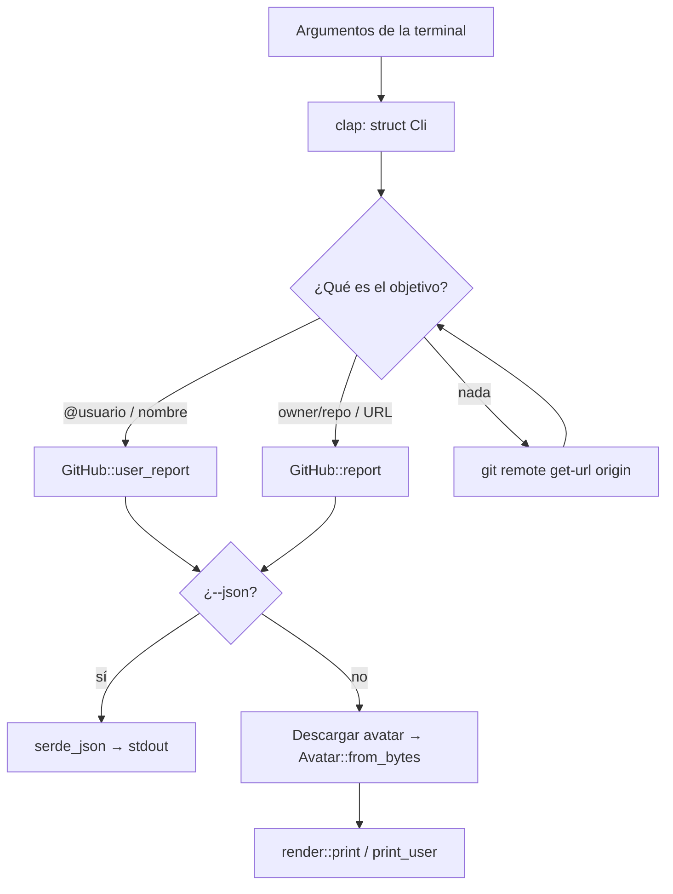

# Arquitectura

Volver a [[Volgit]].

## Flujo de un comando



## Responsabilidad de cada archivo

**`main.rs`** hace de orquestador: no sabe nada de HTTP ni de colores. Lee los argumentos, decide qué hay que consultar, llama a `github.rs`, decide si mostrar la foto y le pasa todo a `render.rs`.

**`github.rs`** contiene los datos y la red. Define structs (`Repo`, `User`, `Event`…) con la misma forma que el JSON de GitHub, y un cliente con una función genérica `get` que usan todas las consultas. Ver [[API de GitHub]].

**`avatar.rs`** se ocupa de la imagen: convierte los bytes de una imagen en líneas de texto con color y calcula el color de acento. Ver [[Foto de perfil]].

**`render.rs`** se ocupa de la presentación: maqueta y pinta. Recibe los datos ya descargados y no hace ninguna petición. Ver [[Renderizado]].

Separarlo así permite, por ejemplo, que `--json` reutilice exactamente los mismos datos sin tocar `render.rs`. También permite testear el render sin red.

## Definir la CLI con clap

`clap` genera el parser de argumentos a partir de un struct. Cada campo es una opción y el comentario `///` de encima es el texto de la ayuda:

```rust
#[derive(Parser)]
#[command(
    version,
    about,
    after_help = EXAMPLES,          // bloque de ejemplos al final de --help
    disable_help_flag = true,       // quitamos el -h de serie (sale en inglés)...
    disable_version_flag = true,
    next_help_heading = "Opciones", // ...y traducimos los títulos
    override_usage = "volgit [OPCIONES] [OBJETIVO]",
    help_template = "{name} {version}\n{about}\n\nUso: {usage}\n\n{all-args}{after-help}",
)]
struct Cli {
    /// Cuántos contribuidores / repos destacados mostrar (por defecto 5)
    #[arg(short, long, default_value_t = 5, value_name = "N", hide_default_value = true)]
    top: usize,

    /// Token de GitHub (por defecto lee GITHUB_TOKEN)
    #[arg(long, env = "GITHUB_TOKEN", hide_env_values = true, value_name = "TOKEN")]
    token: Option<String>,

    /// Muestra esta ayuda
    #[arg(short, long, action = ArgAction::Help)]
    help: Option<bool>,
    // ...
}
```

Detalles a tener en cuenta:
- `env = "GITHUB_TOKEN"` hace que, si no pasas `--token`, clap lea la variable de entorno. `hide_env_values` evita que el token aparezca impreso en la ayuda.
- `Option<String>` significa que la opción es opcional: vale `None` si no se da.
- Para traducir `-h`, se desactiva el flag de serie y se declara uno propio con `ArgAction::Help`.
- El rango de `--avatar-size` lo valida clap con `value_parser!(u16).range(8..=80)`. Un `3` se rechaza antes de llegar a nuestro código.

## Decidir si es repo o usuario

Hay dos funciones puras, sin red, y ambas tienen tests en `main.rs`:

```rust
/// Acepta "@login", "login" o "https://github.com/login".
fn parse_user(s: &str) -> Option<String> {
    let s = s.trim().trim_end_matches('/');
    // Si hay "github.com/", nos quedamos con lo que va detrás.
    let s = s.split_once("github.com/").map(|(_, r)| r).unwrap_or(s);
    let s = s.strip_prefix('@').unwrap_or(s);
    // Es usuario solo si no queda ninguna "/" (eso sería owner/repo)
    // ni ":" (formato SSH git@github.com:o/r).
    (!s.is_empty() && !s.contains(['/', ':'])).then(|| s.to_string())
}
```

`condición.then(|| valor)` es la forma idiomática de decir "si la condición es cierta, `Some(valor)`, si no, `None`".

`main` prueba primero `parse_user`. Si devuelve `None`, prueba `parse_slug`:

```rust
fn parse_slug(s: &str) -> Option<(String, String)> {
    let s = s.trim().trim_end_matches('/').trim_end_matches(".git");
    // Cubre "https://github.com/o/r" y "git@github.com:o/r" a la vez:
    // cortamos por "github.com" y quitamos los ':' o '/' que quedan delante.
    let s = s
        .split_once("github.com")
        .map(|(_, rest)| rest.trim_start_matches([':', '/']))
        .unwrap_or(s);
    let mut parts = s.split('/');
    // El `?` sale devolviendo None si no hay dos partes.
    let (owner, name) = (parts.next()?, parts.next()?);
    (!owner.is_empty() && !name.is_empty()).then(|| (owner.into(), name.into()))
}
```

Como solo se leen las dos primeras partes, una URL como `github.com/o/r/tree/main/src` también funciona.

## Cuándo se muestra la foto

```rust
let show_avatar = !cli.json && !cli.no_avatar && !cli.no_color && std::io::stdout().is_terminal();
```

La foto se imprime con códigos ANSI "a mano" (ver [[Foto de perfil]]), así que no la controla la librería de colores. Por eso hay que comprobar explícitamente que la salida es una terminal.

## SIGPIPE y unsafe

```rust
#[cfg(unix)]
unsafe {
    libc::signal(libc::SIGPIPE, libc::SIG_DFL);
}
```

Con `volgit x | head -3`, `head` cierra la tubería tras 3 líneas. Los programas de Unix reciben la señal SIGPIPE y terminan en silencio, pero Rust la ignora por defecto. Eso convierte la siguiente escritura en un error, y `println!` hace un *panic* con "Broken pipe". Esta línea restaura el comportamiento clásico.

- Es `unsafe` porque llama a una función de C a la que Rust no puede garantizar nada.
- `#[cfg(unix)]` hace que solo se compile en Linux o macOS: en Windows no existe SIGPIPE.

Relacionado: [[Rust en Volgit#unsafe y cfg]].
