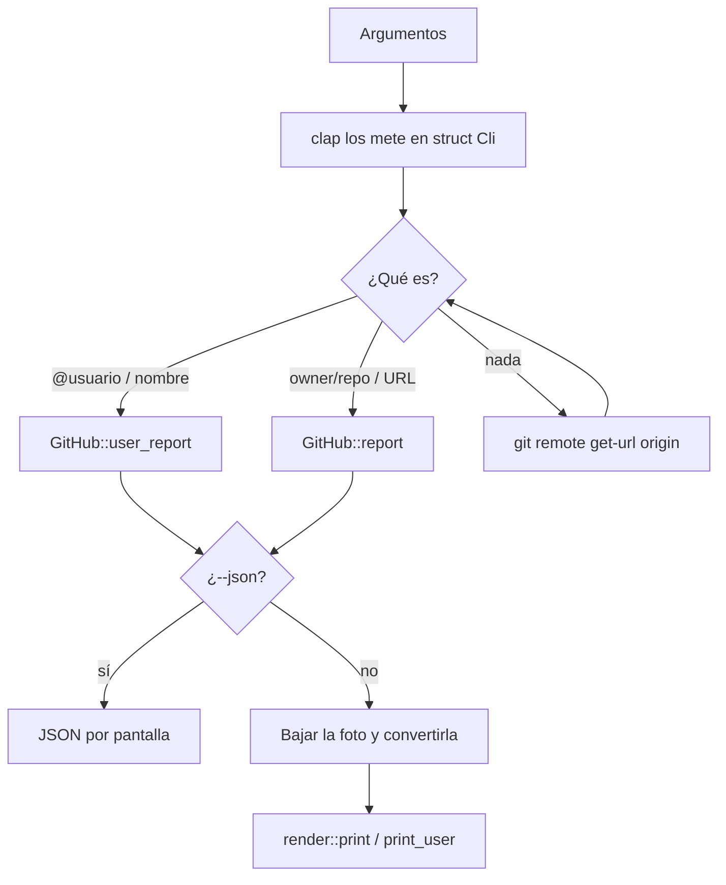

# Arquitectura

Volver a [[Volgit]]

## Qué pasa cuando ejecuto un comando



## Para qué sirve cada archivo

Lo separé así para que cada parte haga una sola cosa:

- `main.rs` es el que manda. No sabe nada de HTTP ni de colores: lee los argumentos, decide qué hay que consultar, pide los datos, decide si hay foto y se lo pasa todo al render.
- `github.rs` habla con GitHub. Tiene los structs con la misma forma que el JSON que devuelve la API y una función `get` que usan todas las consultas. Ver [[API de GitHub]].
- `avatar.rs` convierte la foto en algo que la terminal pueda enseñar. Ver [[Foto de perfil]].
- `term.rs` le pregunta cosas a la terminal: cuánto mide, qué proporción tienen sus celdas y si soporta imágenes.
- `render.rs` pinta. Recibe los datos ya descargados y no hace ninguna petición. Ver [[Renderizado]].

La ventaja es que `--json` usa exactamente los mismos datos sin tocar nada del render, y que el render se puede testear sin internet.

## La CLI con clap

`clap` construye todo el parser a partir de un struct. Cada campo es una opción, y el comentario `///` que lleva encima es lo que sale en `--help`:

```rust
#[derive(Parser)]
#[command(
    version,
    about,
    after_help = EXAMPLES,          // los ejemplos del final de --help
    disable_help_flag = true,       // quito el -h que viene de serie porque sale en inglés
    disable_version_flag = true,
    next_help_heading = "Opciones",
    override_usage = "volgit [OPCIONES] [OBJETIVO]",
    help_template = "{name} {version}\n{about}\n\nUso: {usage}\n\n{all-args}{after-help}",
)]
struct Cli {
    /// Cuántos contribuidores / repos mostrar, o "all" para todos (por defecto 5)
    #[arg(short, long, default_value = "5", value_name = "N|all", hide_default_value = true, value_parser = parse_top)]
    top: usize,

    /// Token de GitHub (por defecto lee GITHUB_TOKEN)
    #[arg(long, env = "GITHUB_TOKEN", hide_env_values = true, value_name = "TOKEN")]
    token: Option<String>,

    /// Muestra esta ayuda
    #[arg(short, long, action = ArgAction::Help)]
    help: Option<bool>,
    // ...
}
```

Cosas que aprendí montando esto:
- Con `env = "GITHUB_TOKEN"`, si no paso `--token` clap lee la variable de entorno él solo. `hide_env_values` sirve para que el token no se imprima en la ayuda.
- Un `Option<String>` es una opción que puede no estar: vale `None` si no la paso.
- Para tener el `-h` en español hay que desactivar el de serie y declarar uno propio con `ArgAction::Help`.
- `--avatar-size` lo valida clap con `value_parser!(u16).range(8..=80)`. Si pongo un 3 lo rechaza antes de que llegue a mi código.
- `--top` acepta un número o `all`. Para eso le paso mi propia función, `parse_top`, que convierte `all` en `usize::MAX`, o sea, "sin límite".

## Decidir si es repo o usuario

Son dos funciones que no tocan la red, así que les hice tests en `main.rs`. Primero se prueba con `parse_user`:

```rust
/// Acepta "@login", "login" o "https://github.com/login".
fn parse_user(s: &str) -> Option<String> {
    let s = s.trim().trim_end_matches('/');
    // Si hay "github.com/", me quedo con lo que va detrás.
    let s = s.split_once("github.com/").map(|(_, r)| r).unwrap_or(s);
    let s = s.strip_prefix('@').unwrap_or(s);
    // Solo es usuario si no queda ninguna "/" (eso sería owner/repo)
    // ni ":" (el formato SSH git@github.com:o/r).
    (!s.is_empty() && !s.contains(['/', ':'])).then(|| s.to_string())
}
```

El `.then(|| ...)` del final es la forma bonita de escribir "si la condición se cumple, `Some(valor)`, y si no, `None`".

Si eso devuelve `None`, se prueba con `parse_slug`:

```rust
fn parse_slug(s: &str) -> Option<(String, String)> {
    let s = s.trim().trim_end_matches('/').trim_end_matches(".git");
    // Esto cubre "https://github.com/o/r" y "git@github.com:o/r" de una vez:
    // corto por "github.com" y quito los ':' o '/' que se quedan delante.
    let s = s
        .split_once("github.com")
        .map(|(_, rest)| rest.trim_start_matches([':', '/']))
        .unwrap_or(s);
    let mut parts = s.split('/');
    // El `?` hace que la función devuelva None si no hay dos trozos.
    let (owner, name) = (parts.next()?, parts.next()?);
    (!owner.is_empty() && !name.is_empty()).then(|| (owner.into(), name.into()))
}
```

Como solo miro los dos primeros trozos, una URL larga del estilo `github.com/o/r/tree/main/src` también funciona.

## Cuándo sale la foto

```rust
let show_avatar = !cli.json && !cli.no_avatar && !cli.no_color && std::io::stdout().is_terminal();
```

La foto la imprimo con códigos de escape a mano (ver [[Foto de perfil]]), así que la librería de colores no se entera de que existe. Por eso compruebo yo que la salida va a una terminal de verdad y no a un archivo.

Qué modo usar (bloques o kitty) lo decide `ImageArg::resolve`. Si es `auto`, pregunta a `term::supports_kitty_graphics()`, que mira variables como `TERM`, `KITTY_WINDOW_ID` o `TERM_PROGRAM`, y descarta tmux.

## SIGPIPE y el único unsafe de main

```rust
#[cfg(unix)]
unsafe {
    libc::signal(libc::SIGPIPE, libc::SIG_DFL);
}
```

Esto lo metí porque con `volgit x | head -3` el programa petaba con un "Broken pipe". Lo que pasa es que `head` cierra la tubería después de leer 3 líneas. Un programa normal de Unix recibe entonces la señal SIGPIPE y se muere sin decir nada, pero Rust ignora esa señal por defecto, así que la siguiente escritura falla y `println!` hace *panic*. Con esta línea vuelve el comportamiento de toda la vida.

- Va dentro de `unsafe` porque llama a una función de C y Rust no puede garantizar nada de ella.
- `#[cfg(unix)]` hace que solo se compile en Linux o macOS, porque en Windows no existe SIGPIPE.

Relacionado: [[Rust en Volgit#unsafe y cfg]].
